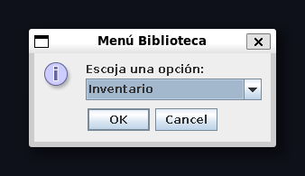

# Library Administrative System Java

Library management system, allows to manage book inventories, member registration, book loan and return processes in a library, and store book information.

## Screenshots

## Features

- Registering members to the library
- Managing book inventory
- Managing book loans
- Managing book returns
- Applying late fees
- Searching books by category and SBN

## Authors

- [@ch3ber](https://www.github.com/ch3ber)
- [@j1eo](https://www.github.com/j1eo)

